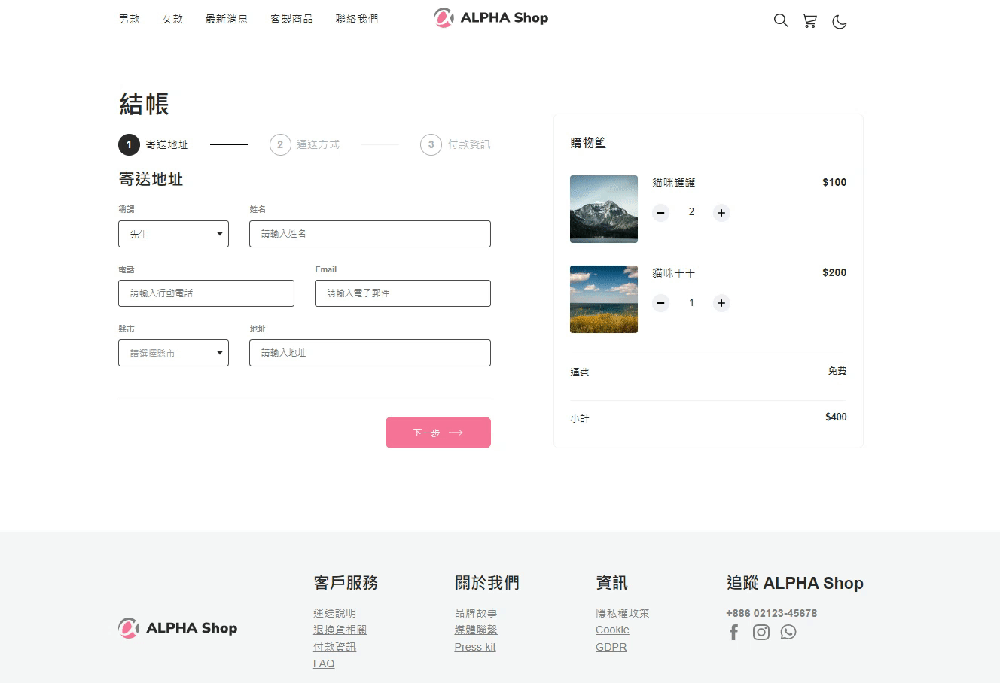

# Alpha Shop
AC 前端教案練習，使用 React 為電商網頁切版、實作畫面互動功能。



# 🚀 Getting start 開始使用
1. 請先確認有安裝 Node.js 與 npm

2. 將專案 clone 到本地，在終端機輸入：

```
  $ git clone https://github.com/TimWang95/alpha_shop.git
```
3. 在本地開啟之後，透過終端機進入資料夾，輸入：
```
  $ npm install
```
4. 安裝完畢後，繼續輸入：
```
  $ npm start
```
5. 若在最末行看見此訊息則代表順利運行，且瀏覽器會自動進入到該網址：http://localhost:3000
```
  webpack compiled successfully
```
6. 若欲暫停使用，請按下：`ctrl + c`

## :computer: Technologies 開發工具
* Node.js 14.16.0
* react 18.2.0
* react-dom 18.2.0
* Sass